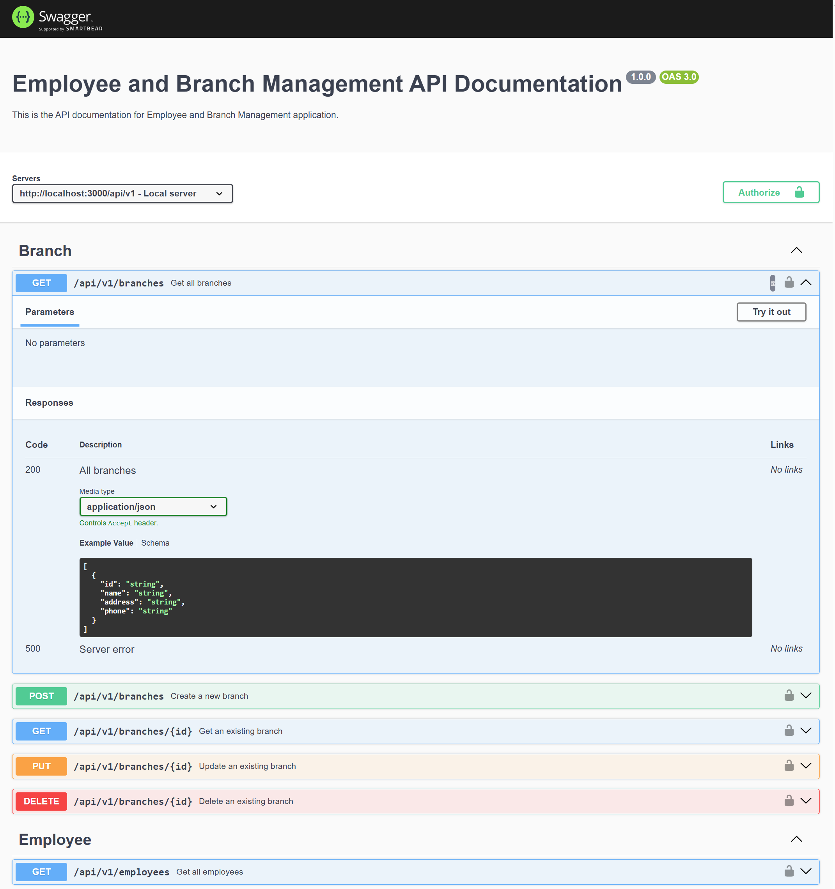
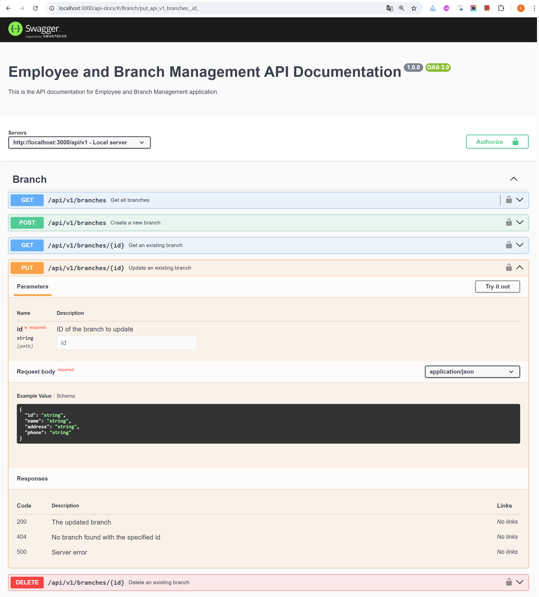
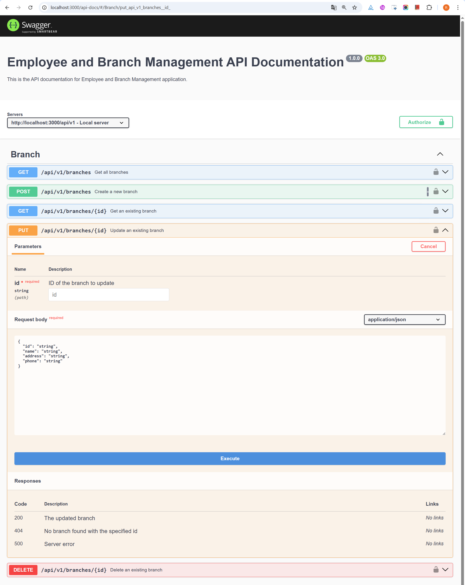
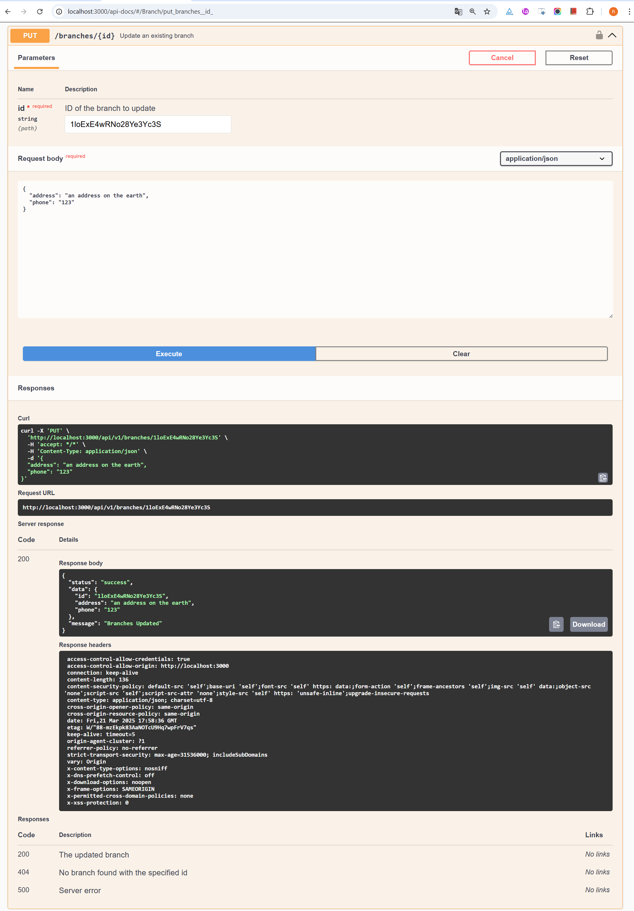

<p align="center">
    <h1>Employee and Branch Management API</h1>
    <em>Easy to manage employee and branch information</em>
</p>

---

**Documentation**: <a href="https://pinyirao.github.io/Back-End-assignment05-OpenAPI-Docs/" target="_blank">https://pinyirao.github.io/Back-End-assignment05-OpenAPI-Docs/</a>

**Source Code**: <a href="https://github.com/PINYIRAO/Back-End-Assignment02/tree/assignment05" target="_blank">https://github.com/PINYIRAO/Back-End-Assignment02/tree/assignment05</a>

---

This is a framework for managing employee and branch information.

The key features are:

* **CURD**: Very reliable to mange the employee and branch information.
* **Security**: Secured the API with cors and helmet library.
* **Easy**: Easy to use and learn. Less time debugging.
* **Standards-based**: Based on (and fully compatible with) the open standards for APIs: <a href="https://github.com/OAI/OpenAPI-Specification" class="external-link" target="_blank">OpenAPI</a> (previously known as Swagger) and <a href="https://json-schema.org/" class="external-link" target="_blank">JSON Schema</a>.

## Requirements
- [Node.js](https://nodejs.org/) (version 14 or later)
- [npm](https://www.npmjs.com/) (comes with Node.js)

## Installation

### Clone Repository

Create a project folder and then clone the project:

<div class="termy">

```bash
$ git clone https://github.com/PINYIRAO/Back-End-Assignment02
```

###  Install dependencies:
```bash
npm install
```

### Configure it
Configure a .env file in the project root directory for dotenv containing the content as below:

```console
NODE_ENV=filler
PORT=filler
FIREBASE_PROJECT_ID=filler
FIREBASE_PRIVATE_KEY=filler
FIREBASE_CLIENT_EMAIL=filler
SWAGGER_SERVER_URL=filler
```

NODE_ENV indicated the project environment type, the PORT means the API endpoints' port. We also need to configure the FIREBASE_PROJECT_ID, FIREBASE_PRIVATE_KEY, and FIREBASE_CLIENT_EMAIL for the project to ensure we could interact with a firestore database. The SWAGGER_SERVER_URL is the url configuration for swagger server.

### Run it

Run the server with:

<div class="termy">

```bash
$ npm start

> back-end-assignment02@1.0.0 start
> ts-node src/server.ts

(node:30528) [DEP0040] DeprecationWarning: The `punycode` module is deprecated. Please use a userland alternative instead.
(Use `node --trace-deprecation ...` to show where the warning was created)
Server is running on port 3000

```

</div>

### Check it

Open your browser at <a href="http://localhost:3000/health" class="external-link" target="_blank">http://localhost:3000/health</a>.

You will see the string response as:

```console
Server is healthy
```

You already started the API server successfully

### Interactive API docs

Now go to <a href="http://localhost:3000/api-docs/" class="external-link" target="_blank">http://localhost:3000/api-docs/</a>.

You will see the automatic interactive API documentation (provided by <a href="https://github.com/swagger-api/swagger-ui" class="external-link" target="_blank">Swagger UI</a>):



### Alternative API docs

And now, go to <a href="https://pinyirao.github.io/Back-End-assignment05-OpenAPI-Docs/" class="external-link" target="_blank">https://pinyirao.github.io/Back-End-assignment05-OpenAPI-Docs/</a>.

You will see the alternative documentation (provided by GitHub Pages):

## Interactive API docs 

Now go to <a href="http://localhost:3000/api-docs/" class="external-link" target="_blank">http://localhost:3000/api-docs/</a>.

* The interactive API documentation will be automatically updated, including the new body:



* Click on the button "Try it out", it allows you to fill the parameters and directly interact with the API:



* Then click on the "Execute" button, the user interface will communicate with your API, send the parameters, get the results and show them on the screen:




Coming back to the previous code example, **Employee and Branch Management API** will:

* Validate the data in the path for `POST` and `PUT` requests.
    * check to see whether the data type is valid
    * check to see whether the string length is valid 
    * check to see whether the required parameters are missing 

---
## Dependencies

This API application depends on Express, firebase, Joi, helmet, and cors and other libraries.

## License

This project is licensed under the terms of the MIT license.